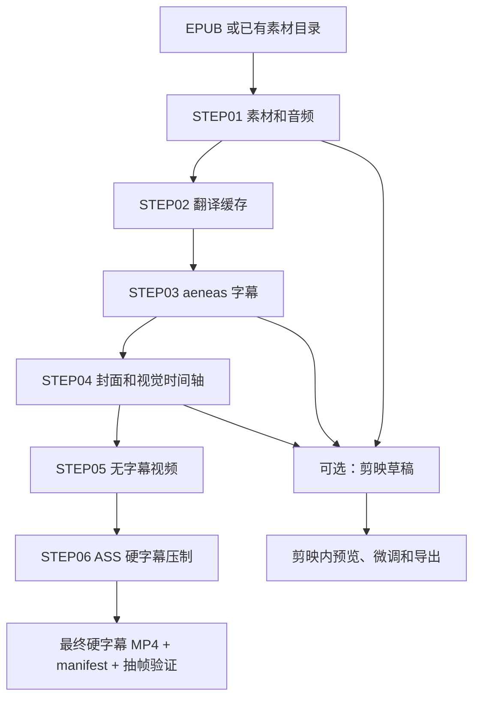

# A Book in 30 Minutes 视频生成设计

## 目标

把已生成的听书素材从“音频 + 字幕”推进到可发布的视频成片。当前优先目标是适合睡前听书的 YouTube 长视频：画面安静、字幕清晰、旁白优先、背景音乐低存在感。

## 输入产物

- 旁白音频：`audio/**/*.mp3`
- 中文字幕：`subtitles/*.zh.srt`
- 双语字幕：`subtitles/*.zh-en.srt`
- 双语 ASS：`subtitles/*.zh-en.ass`
- 视觉原图资产：`visual_assets/originals/**/visual_assets_manifest.json`
- 图片字幕时间轴：`visual_assets/originals/**/visual_timeline.json` 或 SQLite `visual_timeline_segments`
- 素材文本：`title.txt`、`description.txt`、`tags.txt`、`narration.txt`、`subtitles.txt`
- 可选背景音乐：用户提供的免版权音乐文件，或生成低音量环境音轨作为临时预览。

## 推荐视频形态

当前推荐采用“剪映草稿优先”的视频工作流。脚本负责快速生成可编辑草稿，剪映负责最终预览、微调和导出。ffmpeg 仍保留为 60 秒预览或无剪映环境下的兜底方案。

当用户明确要求“完整硬字幕视频”时，采用通用直出流水线 `tmp/book_video_pipeline.py`。该流水线不依赖具体书名，输入任意 EPUB 后按 `STEP01-STEP06` 生成素材、音频、aeneas 字幕、封面、视觉时间轴、无字幕视频和硬字幕视频。它参考 `D:\04_GitHub\video-easy-creator` 的步骤化执行中心设计，把整次任务写入 SQLite `operation_history`，把每一步写入 `operation_step`，把日志事件写入 `operation_event`；上下文中断后可用 `--material-dir` 从已有素材目录恢复，避免重复调用 AI 和 TTS。

### 画面

采用“内容时间轴 + 统一视觉体系”的听书视频形式。当前保留两条正式视觉路线：

- 电影感主题图路线：每本书生成 4 到 12 张主题画面，适合文学评论、历史、思想类书籍。图片必须来自高清原图资产，不使用截图、缩略图、视频帧或模糊派生图作为最终背景源。剪映草稿中把每个时间轴片段作为背景轨片段，后续可在剪映中添加缓慢缩放、转场和轻微调色；ffmpeg 预览模式才直接生成 Ken Burns 动画片段。
- 程序化解释插画路线：每本书按完整 SRT 生成 20 到 40 张白底手绘解释图，适合《山茶的情书》这种需要人物、道具、情绪和时间推进的读书视频。图片由程序化 SVG/Canvas/Pillow 组件生成，统一人物 IP、道具库、中文注释、箭头和构图模板，再交给白板动画 skill 生成手绘动画。

无论采用哪条路线，每张图都必须绑定它对应的字幕/旁白文本范围，视频生成时按 `visual_timeline` 或 `image_timeline.json` 的 `start_ms` 和 `duration_ms` 铺图，而不是按图片数量平均切分音频。

完整无字幕直出版本可以在时间轴前增加 3 到 5 秒封面片头。封面片头只显示本地模板绘制后的封面图；旁白音频必须整体延后同样时长，避免封面占用原始旁白时间。片头结束后再按 `visual_timeline` 铺设内容图。该模式仍然不烧录字幕，适合发布前检查画面、音频和封面整体气质。

《我的文学奖》示例画面方向：

- 文学颁奖大厅，但保持疏离、冷清。
- 维也纳男装店与领奖前买西装。
- 肺病医院、病房、纸牌与死亡。
- 法兰克福旅馆修稿《严寒》。
- 华沙冬天、校样、学生宿舍。
- 国家文学奖讲话冷场。
- 奖金、修窗、夜晚房间。
- 退出科学院、空餐厅与离开的背影。

正式图像提示词应从旁白节点或字幕段落提炼，确保画面与内容相关。人物尽量使用背影、侧影或文学意象，避免未经授权的真实人物肖像。

本书当前视觉设计思想：以“冷静、出版感、舞台疏离感”为主线，不做热闹的颁奖庆典，而是用空大厅、夜色、背影、病房、旅馆、宿舍、修窗和空餐厅表现奖项背后的尴尬、疾病、金钱和制度。所有 AI 图像都要求无文字、无 logo、无可读标牌；封面文字由 Pillow 本地模板绘制。

封面底图提示词：

```text
cinematic literary award hall at night in Vienna, empty ceremonial auditorium, red velvet curtains, cold spotlight on a small wooden podium, rows of dark chairs, a solitary older male figure seen from behind in the lower left, European classical interior, quiet ironic atmosphere, elegant but unsettling, no readable text, no logos, no banners, no subtitles, 16:9 composition, high detail, realistic painterly cinematic lighting
```

内容图提示词：

| 图 | 内容节点 | 提示词 |
| --- | --- | --- |
| 1 | 文学奖的冷光与荒诞 | `empty European literary award ceremony hall at night, cold spotlight on podium, rows of chairs, framed certificates on side tables, solitary male figure seen from behind, red velvet curtains, marble floor, Vienna atmosphere, elegant but alienating, no readable text, no logos, cinematic 16:9, high detail` |
| 2 | 维也纳男装店与领奖前买西装 | `old Vienna menswear shop interior, dark wooden shelves, black formal suits, measuring tape, mirror reflections, a nervous solitary customer seen from behind, 1960s European mood, warm shop light mixed with cold window light, literary cinematic realism, no readable text, no logos, 16:9` |
| 3 | 肺病医院、病房、纸牌与死亡 | `mid century tuberculosis hospital ward, narrow beds, pale sheets, small table with playing cards, winter light through tall windows, quiet patients implied but not shown clearly, sterile and melancholic atmosphere, muted colors, realistic cinematic still, no readable text, 16:9` |
| 4 | 法兰克福旅馆修稿《严寒》 | `Frankfurt hotel room at night, small desk with manuscript pages and pencil corrections, warm desk lamp, rain on window, suitcase half open, lonely writer implied by coat on chair, European literary realism, intimate but austere, no readable text, no logos, 16:9` |
| 5 | 华沙冬天、校样和金钱暗线 | `Warsaw winter student dormitory room, frosted window, stacks of proof pages on a small desk, dim radiator, simple bed, cold blue gray light, Eastern European austerity, a small envelope of money on the table, cinematic quiet realism, no readable text, 16:9` |
| 6 | 奥地利国家文学奖讲话冷场 | `Austrian state literary award ceremony, formal hall, podium under hard spotlight, officials seated stiffly in the shadows, tense silence, speaker seen from behind or side silhouette, red curtains, marble walls, cold ceremonial mood, no readable text, no logos, cinematic 16:9` |
| 7 | 维尔德甘斯奖、奖金、修窗和现实 | `night apartment interior in Vienna, cracked window being repaired, envelope of award money on wooden table, tools, receipts, cold street light outside, quiet domestic realism, literary irony, no readable text, no logos, cinematic 16:9` |
| 8 | 退出科学院与离开制度房间 | `empty academy dining room after a formal dinner, long table with white cloth, abandoned glasses and plates, tall windows at night, a solitary figure leaving through a doorway seen from behind, institutional elegance turning cold, no readable text, no logos, cinematic 16:9` |

### 字幕

剪映草稿模式默认导入双语 SRT，中文第一行、英文第二行，作为可编辑字幕轨。ffmpeg 预览/直出模式默认烧录双语 ASS。中文字幕为主，英文为副。ASS 生成时先对纯文本转义，再用 ASS 原生 `\N` 插入换行，避免反斜线被当作可见字符显示。

长视频硬字幕样式以 `yt-download` 当前双语 ASS 效果为参考，避免生成过小、过细、描边不足的字幕。推荐样式为：中文 `Chinese` 使用 `Microsoft YaHei UI`、字号 `128`、颜色 `&H00C8F6FF`、粗体、黑色描边 `5`、阴影 `2`、Alignment `2`、左右边距 `120`、底边距 `238`；英文 `English` 使用同字体、字号 `82`、颜色 `&H001AA5F2`、粗体、黑色描边 `5`、阴影 `2`、Alignment `2`、左右边距 `120`、底边距 `140`。该样式来自参考文件 `D:\05_Green\Yt-Download-Portable\downloads\apple\vod_main_vdhwwrygnmzydhppixlrqwduiqffztdw.zh-en.ass`，适合 1920x1080 横屏听书视频。

带封面片头的直出视频在烧录 ASS 前必须整体延后字幕时间轴。当前封面片头为 `5` 秒，因此所有 ASS Dialogue 需要延后 `5000ms`，第一条字幕应从 `0:00:05.00` 开始，避免片头阶段提前出现字幕，也避免正文画面与旁白错位。

字幕时间轴优先使用当前 `.ass` 或 `.zh.srt` 文件；如果后续接入 ASR 或 forced alignment，则以强制对齐后的时间轴替换估算时间轴。图片时间轴必须引用同一份字幕时间轴，记录每张图对应的 `start_subtitle_index`、`end_subtitle_index`、`start_time` 和 `end_time`，保证画面切换与字幕内容一致。

硬字幕压制必须以无字幕完整视频为源，不允许把已经烧录字幕的 `.hardsub.mp4` 再作为源视频。`tmp/burn_ass_hardsub.py` 会先生成整体延迟后的 ASS，再调用 ffmpeg `ass=` 滤镜；延迟后的中间 ASS 文件固定命名为 `hardsub_delay5000ms.ass`，使用短 ASCII 文件名规避 libass 在超长中文路径或文件名下打开失败。

### 音频

旁白是主音轨。背景音乐或环境音只作为氛围，剪映草稿中默认加入低音量 `BGM` 轨，音量约 `0.10`；ffmpeg 混音时默认控制在 `-28dB` 到 `-34dB` 附近。初版可以用脚本生成的低频 pad 作为临时底音；正式发布建议替换为明确可商用的免版权 BGM。

## 流水线



## Codex 与 AI 的分工

- Codex/Image generation：生成主题背景图、封面图、章节插图等位图资产；当前不作为《山茶的情书》配图主方案。
- Codex/程序化插画：解析 SRT、设计分镜、抽取字幕名词、生成统一人物 IP 和道具组件，输出 4K PNG、`scene_plan.json` 和 `image_timeline.json`。
- Codex/脚本：生成 ffmpeg 命令、manifest、校验报告和自动化流水线。
- jianying-editor-skill：负责创建剪映草稿、导入媒体、导入 SRT 字幕和保存工程。
- ffmpeg：负责预览模式的视频片段、缩放平移、音频混合、字幕烧录和最终编码；也用于探测音频时长和生成临时 BGM。
- AI 文本模型：可生成画面提示词、章节画面分配、英文字幕翻译和发布文案。
- whiteboard-animation skill：把程序化插画转成白板手绘动画片段，负责线稿绘制、上色阶段和手部覆盖效果。

不建议直接让 AI 生成完整 32 分钟视频。长视频应由确定性的本地脚本生成剪映草稿或本地合成，方便重复生成、排错和替换素材。

## 视觉资产与字幕时间轴

视频画面资产分为两层：

- 原图层：`visual_assets/originals/<批次>/`，保存 AI 生成或用户导入的高清原图。该目录包含 `visual_assets_manifest.json` 和 `visual_timeline.json`。
- 派生层：`visual_assets/derived/<批次>/` 或 `video/jianying_draft/assets/`，保存为剪映或 ffmpeg 生成的裁切、转码、预览副本。

正式视频必须从原图层开始构建，不得直接使用截图帧、缩略图、视频预览帧或雾化/模糊处理后的图片。若需要 1920x1080、4K、JPG 转码或轻微缩放，生成派生副本并保留到 `derived`，原图不可覆盖。

`visual_assets_manifest.json` 保存每张图片的基础信息：

```json
{
  "sortOrder": 1,
  "scene": "awards_hall_cold_ceremony",
  "file": "C:\\...\\01_awards_hall_cold_ceremony.png",
  "codexSource": "C:\\Users\\Administrator\\.codex\\generated_images\\...\\ig_xxx.png",
  "width": 1672,
  "height": 941,
  "bytes": 2246079,
  "sha256": "..."
}
```

`visual_timeline.json` 保存图片与字幕段落的对应关系。每段必须包含：

- `timelineId`：时间轴片段 ID。
- `assetId`：对应 SQLite `visual_assets.asset_id`。
- `assetFile`：原图文件路径。
- `startSubtitleIndex` / `endSubtitleIndex`：字幕编号范围。
- `startTime` / `endTime`：字幕时间范围。
- `startMs` / `endMs` / `durationMs`：视频轨道时间。
- `promptSource`：生成图片时使用的文本节点。
- `sourceTextPreview`：对应字幕文本预览。
- `rationale`：图片与该段文本的对应理由。

视频生成消费规则：

- 剪映草稿按 `visual_timeline` 创建背景轨片段，图片片段的起止时间与字幕时间一致。
- ffmpeg 预览/直出按同一时间轴拼接图片，不做平均分配。
- 如果 `visual_timeline` 缺失，视频阶段应提示先生成视觉时间轴。
- 如果某个 `assetFile` 不存在，视频阶段应失败并提示缺失路径。

## 程序化白板插画路线

《山茶的情书》当前采用程序化解释插画路线，目标不是生成随机漂亮背景，而是制作接近 B 站“小黑解释类插画”但主角替换为可爱小女孩 IP 的读书视频画面。该路线吸收 `whiteboard-video-workflow` 和 `helloianneo/ian-xiaohei-illustrations` 的方法：白底、手绘线条、夸张动作、中文注释、箭头、道具、生活场景和隐喻图形，但所有人物、物品和文字都由本地程序稳定绘制，避免 AI 图片出现人物漂移、多个重复人物、年代错位或中文乱码。

当前实现脚本为：

```text
whiteboard-video/whiteboard-animation-skill/skills/whiteboard-video-workflow/scripts/render-book-xiaohei.py
C:/Users/Administrator/.codex/skills/whiteboard-video-workflow/scripts/render-book-xiaohei.py
```

正式输入优先使用 aeneas 对齐后的完整 SRT，例如：

```text
D:/books/0625新书四本/2025-01《山茶的情书》/output/hard_subtitle.aeneas.cmn.srt
```

当前《山茶的情书》验证参数：

- 字幕条数：`837`。
- 总时长：`1,802,920ms`，约 `30.05` 分钟。
- 图片数量：`30` 张，约每分钟一张。
- 输出尺寸：`3840x2160` PNG。
- 输出目录：`tmp/camellia_letter_scenes/book_xiaohei_full_srt_v3_4k`。
- 元数据：`scene_plan.json` 保存分镜计划，`image_timeline.json` 保存每张图的精确起止时间、字幕摘要、抽取道具和文件名。

程序化插画的固定规则：

- 主角是同一套“小女孩 IP”：短发、山茶发夹、脸颊腮红、青绿色连衣裙或围裙，动作包括站立、推、拉、写信、搬运、侧身、背影和更夸张的关键姿势。
- 人物必须符合书本年代和故事气质，不能变成现代通用动漫头像，也不能只作为画面角落的小标记；关键画面中人物要放大并与道具发生动作关系。
- 画面以白底解释插画为基准，但不能只有图标和线条。每张图应包含生活物品、空间关系、天气或自然元素，例如信封、山茶、文具店、饭碗、渡轮、雨窗、书架、茶杯、台灯、照片、植物、季节物件和水面。
- 字幕里的具体名词优先进入候选道具库，但必须服务当前段落含义，不能为了堆物品而让画面拥挤。
- 中文说明必须自动换行并限制在卡片内，不得被画布裁切或跑出图片边界。
- 图片左上角不显示“XX 分钟”之类时间字样；时间只记录在 JSON 元数据里。
- 所有中文文案、日志和 JSON 必须 UTF-8 正常显示，不得出现乱码。

后续视频合成消费规则：

- `image_timeline.json` 是白板插画路线的视频时间轴来源，每张 PNG 的起止时间必须和 SRT 分段连续覆盖，不能平均猜时长。
- 白板动画阶段先把每张 PNG 转成对应时长的手绘动画片段，再按 `image_timeline.json` 拼接。
- 如果只做静态预览，可先按同一时间轴直接铺 PNG；正式成片再替换为白板动画片段。
- 任何重新生成的新版本必须放到新的批次文件夹，例如 `book_xiaohei_full_srt_v4_4k`，不得覆盖上一版，方便对照用户反馈。

## 草稿优先策略

长视频优先生成剪映草稿，而不是每次完整 ffmpeg 重编码。这样首次装配只需要十几秒，用户可以在剪映里立即检查字幕、画面、音量和背景音乐。

当前落地脚本为 `tmp/create_book_jianying_draft.py`：

- 自动查找素材目录下的最终 `audio/**/*.mp3`。
- 自动查找 `subtitles/*.zh-en.srt` 和 `subtitles/*.zh-en.ass`。
- 自动读取 `video/assets` 下的背景图片。
- 生成剪映专用双语 SRT，去掉错误 `\` 字符，保留中文和英文两行。
- 创建低音量 `ambient_pad.mp3` 作为临时 BGM。
- 创建剪映草稿轨道：`Background`、`Narration`、`BGM`、`Title`、`BilingualSubtitles`。
- 写入 `video/jianying_draft/video_manifest.json`，记录草稿路径、音频、字幕、背景和时长。

素材生成后的最终字幕时间轴必须使用 aeneas 强制对齐生成，而不是按 mp3 总时长和文本权重估算。当前验证脚本为 `tmp/generate_aeneas_book_subtitles.py`，必须通过 `--material-dir <素材目录>` 指向当前正式素材目录，或让脚本自动发现当前素材包。脚本读取最终中文旁白 mp3 和 `subtitles.txt`，调用 `C:\Program Files\Python39\python.exe -m aeneas.tools.execute_task` 生成对齐时间轴，再输出 `*.aeneas.chn.srt`、`*.aeneas.zh.srt`、`*.aeneas.en.srt`、`*.aeneas.zh-en.srt` 和 `*.aeneas.zh-en.ass`。注意区分两层命名：aeneas 的中文音频参数是 `task_language=cmn`，项目内中文字幕文件名使用 `chn.srt`；英文音频参数为 `task_language=eng`。manifest 必须记录 `audioLanguage=cmn`、输入音频、输入文本、输出 SRT/ASS 和首尾字幕时间。英文翻译继续复用 `subtitles/translation_cache.json` 的编号缓存。

`tmp/generate_book_subtitles.py` 只保留为早期草稿或 aeneas 不可用时的兜底估算脚本，不得作为正式发布字幕时间轴来源。遇到 aeneas 失败时应明确报错并保留 diagnostics、命令参数、音频路径、文本路径和输出路径，不能静默回退为估算时间轴。

图片时间轴临时脚本为 `tmp/build_visual_timeline.py`。该脚本读取当前素材包的 `*.jianying.zh.srt` 和 `visual_assets/originals/<批次>`，按内容关键词锚点生成 `visual_timeline.json`，并写入 SQLite `visual_timeline_segments`。该脚本是产品化前的验证实现，后续应迁移为 Tauri 后端命令。

背景占位图脚本为 `tmp/create_book_backgrounds.py`，只允许用于早期草稿结构验证。当正式 AI 图或授权图尚未准备好时，可生成临时图验证剪映草稿结构、字幕节奏、音频和多画面切换；一旦进入正式视频阶段，必须改用 `visual_assets/originals` 中的 `ai_original/imported_original`，并通过 `visual_timeline` 控制显示时间。

## 初版样片策略

先生成 60 秒预览样片：

- 使用最终 mp3 前 60 秒。
- 使用最终 ASS 字幕。
- 使用 4 张主题图循环慢推拉。
- 使用临时低音量环境底音。
- 输出 `video/preview_60s/*.mp4`。

用户确认画面、字幕位置、音乐音量后，再渲染完整 32 分钟版本。

## 输出结构

```text
video/
  assets/
    scene_01.png
    scene_02.png
    scene_03.png
    scene_04.png
  preview_60s/
    我的文学奖_preview_60s.mp4
    video_manifest.json
  jianying_draft/
    assets/
      scene_01.png
      ambient_pad.mp3
    *.jianying.zh-en.srt
    video_manifest.json
  final/
    我的文学奖_final.mp4
    video_manifest.json
```

新增视觉资产目录：

```text
visual_assets/
  originals/
    20260620_2127_content_images/
      01_awards_hall_cold_ceremony.png
      02_vienna_menswear_shop.png
      03_tuberculosis_ward_cards.png
      04_frankfurt_hotel_revisions.png
      05_warsaw_winter_dorm_proofs.png
      06_state_award_speech_tension.png
      07_award_money_window_repair.png
      08_academy_withdrawal_dining_room.png
      contact_sheet.jpg
      visual_assets_manifest.json
      visual_timeline.json
  derived/
```

## 校验

- 剪映草稿目录存在，并包含 `draft_info.json`。
- 草稿轨道至少包含背景、旁白、BGM 和字幕。
- 使用 `draft_inspector.py summary --name <草稿名>` 检查轨道数量、片段数量和素材引用。
- 剪映专用 SRT 不得出现可见 `/`、`\N` 或多余反斜线。
- 背景图片数量必须大于 1，当前默认至少 5 张。
- 正式背景图片必须来自 `visual_assets` 中的 `ai_original/imported_original`，并有 SHA256、宽高和文件大小记录。
- 每张正式背景图必须在 `visual_timeline` 或 SQLite `visual_timeline_segments` 中有字幕起止时间。
- mp4 预览或直出文件可被 ffmpeg 正常探测。
- 视频时长与目标预览或完整音频时长一致。
- 音频轨存在，采样率正常。
- 字幕版样片应确认字幕已烧录到画面中；无字幕版成片应确认 `render_manifest.json` 中 `hardSubtitles=false`，抽帧中无字幕文字。
- 文件、脚本和 manifest 使用 UTF-8，无 NUL 字节。

## 最新正式草稿

截至 `2026-06-20`，最新可在剪映打开查看的正式草稿为：

- 素材目录：`C:\Users\Administrator\AppData\Roaming\com.abookin30minutes.desktop\exports\20260620_131111_我的文学奖_【奥地利】托马斯·伯恩哈德`
- 剪映草稿名：`我的文学奖_听书视频_短字幕版`
- 剪映草稿路径：`C:\Users\Administrator\AppData\Local\JianyingPro\User Data\Projects\com.lveditor.draft\我的文学奖_听书视频_短字幕版`
- 音频时长：`00:35:15.55`
- 字幕数量：`1288`
- 旧草稿背景数量：`5`，仅作为结构验证，不再作为正式画面质量基线。
- 轨道结构：`Background`、`Narration`、`BGM`、`Title`、`BilingualSubtitles`

截至 `2026-06-21 15:48`，最新正式视觉资产与无字幕成片为：

- 原图目录：`C:\Users\Administrator\AppData\Roaming\com.abookin30minutes.desktop\exports\20260620_131111_我的文学奖_【奥地利】托马斯·伯恩哈德\visual_assets\originals\20260621_0820_content_images`
- 原图数量：`8`
- 原图尺寸：均为 `1672x941`
- 文件大小：约 `2.0-2.3MB`
- 资产清单：`visual_assets_manifest.json`
- 时间轴：`visual_timeline.json`
- 预览拼图：`contact_sheet.jpg`
- SQLite：`visual_assets` 8 条 `ai_original` 记录，`visual_timeline_segments` 8 条时间轴记录。
- 系列封面：`visual_assets\covers\20260621_0937_series_cover\我的文学奖_series_cover_1920x1080.png`
- 无字幕完整视频：`video\cover_timeline_no_subtitle_20260621_1539\我的文学奖_cover_timeline_no_subtitle_20260621_1539.mp4`
- yt-download 风格硬字幕完整视频：`video\cover_timeline_no_subtitle_20260621_1539\我的文学奖_cover_timeline_no_subtitle_20260621_1539.hardsub.ytstyle.mp4`
- yt-download 风格硬字幕 ASS：`video\cover_timeline_no_subtitle_20260621_1539\我的文学奖_cover_timeline_no_subtitle_20260621_1539.ytstyle.delay5000ms.ass`
- aeneas 时间轴硬字幕完整视频：`video\cover_timeline_no_subtitle_20260621_1539\我的文学奖_cover_timeline_no_subtitle_20260621_1539.aeneas.hardsub.mp4`
- aeneas 字幕目录：`subtitles\aeneas_20260621_1951`
- 成片模式：封面片头 `5` 秒，旁白延后 `5000ms`，随后按 8 段内容图时间轴铺图，`hardSubtitles=false`。
- 无字幕成片参数：H.264 `1920x1080`、`30fps`，AAC `48000Hz` 双声道，总时长约 `2120.567` 秒。
- 硬字幕成片参数：H.264 `1920x1080`、`30fps`，AAC `48000Hz` 双声道，总时长 `2120.566667` 秒，SHA256 `9f528aefb55b62083ac6641cc2768a4e53790593204e91cdf19b40e5d2d23ea6`。
- 硬字幕验证帧：`video\cover_timeline_no_subtitle_20260621_1539\hardsub_ytstyle_frames\cover_2s.jpg`、`subtitle_7s.jpg`、`subtitle_10m.jpg`、`subtitle_34m.jpg`。其中 `2s` 片头无字幕，`7s` 起显示参考样式的中英双语硬字幕。
- aeneas 硬字幕参数：H.264 `1920x1080`、`30fps`，AAC `48000Hz` 双声道，总时长 `2120.566667` 秒，SHA256 `4416a1fbdb99cf8a7a95c0f17510b40a098b1ccc92de316213a1f9bc7b2e526d`。验证帧位于 `video\cover_timeline_no_subtitle_20260621_1539\hardsub_aeneas_frames`。

截至 `2026-06-21 23:26`，通用流水线已在《布尔乔亚》上端到端验证通过，并已把旧的通用占位背景替换为正式 AI 内容图：

- 源书：`E:\迅雷下载\0308新书四本\2025-01《布尔乔亚》【豆瓣评分9.0】\2025-01《布尔乔亚》【豆瓣评分9.0】.epub`
- 素材目录：`C:\Users\Administrator\AppData\Roaming\com.abookin30minutes.desktop\exports\20260621_212132_布尔乔亚：在历史与文学之间_【意】弗朗哥·莫莱蒂_【意】弗朗哥·莫莱蒂`
- 流水线 manifest：`C:\Users\Administrator\AppData\Roaming\com.abookin30minutes.desktop\exports\_pipeline_20260621_222244_2025-01《布尔乔亚》【豆瓣评分9.0】\pipeline_manifest.json`
- SQLite 记录：`operation_history.id=4`，`STEP01` 到 `STEP06` 全部 `SUCCESS`。
- aeneas 字幕目录：`subtitles\aeneas_20260621_222245`，`cueCount=1019`，输出 `*.aeneas.chn.srt`、`*.aeneas.en.srt`、`*.aeneas.zh-en.srt` 和 `*.aeneas.zh-en.ass`。
- 封面：`visual_assets\covers\20260621_222255_series_cover\布尔乔亚：在历史与文学之间_【意】弗朗哥·莫莱蒂_series_cover_1920x1080.png`
- 视觉图目录：`visual_assets\originals\20260621_230049_formal_content_images`
- 无字幕视频：`video\cover_timeline_formal_no_subtitle_20260621_2301\20260621_212132_布尔乔亚_formal_cover_timeline_no_subtitle.mp4`
- 硬字幕视频：`video\cover_timeline_formal_no_subtitle_20260621_2301\20260621_212132_布尔乔亚_formal_cover_timeline.aeneas.hardsub.mp4`
- 已作废版本：`visual_assets\originals\20260621_222255_generic_content_images` 和 `video\cover_timeline_no_subtitle_20260621_222257` 使用了通用 Pillow 占位背景，不再作为最终成片。
- 硬字幕参数：封面片头 `5` 秒，ASS 整体延后 `5000ms`，`dialogueCount=2038`，H.264 `1920x1080`、`30fps`，AAC `48000Hz` 双声道，总时长 `1586.0` 秒，SHA256 `f5662f0fdca31107348cc8d840f6db067408c4f9d2eaf2d948b5a2678db08542`。
- 抽帧验证：`hardsub_formal_verify_frames\cover_2s.jpg` 片头无字幕且封面不溢出；`subtitle_7s.jpg` 显示荒岛工作台正式图，`subtitle_10m.jpg` 显示贫穷房间/市场正式图，`subtitle_25m.jpg` 显示档案室正式图，双语硬字幕正常，中文无乱码。

截至 `2026-06-22 00:47`，《布尔乔亚》最终正式封面和硬字幕成片已更新：

- 正式封面：`visual_assets\covers\20260622_003450_formal_series_cover\布尔乔亚：在历史与文学之间_【意】弗朗哥·莫莱蒂_series_cover_1920x1080.png`
- 正式视觉图目录：`visual_assets\originals\20260622_003450_formal_content_images`
- 无字幕视频：`video\cover_timeline_formal_no_subtitle_20260622_003604\20260622_003450_布尔乔亚_formal_cover_timeline_no_subtitle.mp4`
- 硬字幕视频：`video\cover_timeline_formal_no_subtitle_20260622_003604\20260622_003450_布尔乔亚_formal_cover_timeline_no_subtitle.aeneas.hardsub.mp4`
- 硬字幕参数：封面片头 `5` 秒，ASS 整体延后 `5000ms`，`dialogueCount=2038`，H.264 `1920x1080`、`30fps`，AAC `48000Hz` 双声道，总时长 `1586.0` 秒，SHA256 `35ec597c149037c9cd96e807b29182fd13f69bc9b1da17a0e3862908839c7865`。
- 抽帧验证：`hardsub_20260622_verify_frames\cover_2s.jpg` 片头无字幕且封面只显示“布尔乔亚 / 在历史与文学之间”；`subtitle_7s.jpg`、`subtitle_10m.jpg`、`subtitle_25m.jpg` 中双语硬字幕正常。
- 打包/转码注意：C 盘空间紧张时，长视频硬字幕可能在 mp4 mux 阶段报 `Cannot allocate memory`。可先将 `burn_ass_hardsub.py --output` 指向 D 盘工作区临时目录，并使用较低线程数，例如 `--threads 2 --preset ultrafast --crf 20`，成功后再复制成片和 manifest 回素材目录。

截至 `2026-06-22 01:16`，《布尔乔亚》双语字幕已重译润色并重新压制：

- 原问题：旧版英文来自 `translation_cache.json`，与当前 aeneas 中文 cue 存在编号错位，例如第 20 条中文“它关心工作”对应成了“it is actually very close to us.”。
- 处理方式：新增 `tmp/retranslate_aeneas_subtitles.py`，以 aeneas 中文 SRT 的 1019 条 cue 为输入逐条重译，生成独立缓存，不覆盖旧缓存。
- 润色字幕目录：`subtitles\aeneas_polished_20260622_005954`
- 润色 ASS：`subtitles\aeneas_polished_20260622_005954\20260621_212132_布尔乔亚：在历史与文学之间_【意】弗朗哥·莫莱蒂_【意】弗朗哥·莫莱蒂.aeneas.polished.zh-en.ass`
- 推荐硬字幕视频：`video\cover_timeline_formal_no_subtitle_20260622_003604\20260622_005954_布尔乔亚_formal_cover_timeline_polished.aeneas.hardsub.mp4`
- 硬字幕参数：封面片头 `5` 秒，ASS 整体延后 `5000ms`，`dialogueCount=2038`，H.264 `1920x1080`、`30fps`，AAC `48000Hz` 双声道，总时长 `1586.0` 秒，SHA256 `094fe9061c54eb99b6a2921766d3877aed5116ce6c136216b9d14c422977f6ef`。
- 抽样验证：第 20 条“它关心工作 / It is concerned with work.”，第 100 条“种粮食 / growing grain.”，第 500 条“却发现贵族轻蔑他 / only to find the nobles despised him.”，第 1019 条“晚安 / Good night.”。
- 抽帧验证：`hardsub_polished_verify_frames\cover_2s.jpg`、`subtitle_7s.jpg`、`subtitle_10m.jpg`、`subtitle_25m.jpg`。

《布尔乔亚》封面设计思想：

- 使用 `formal_image_typographic_cover_v1`，以正式生成的档案室/旧书房场景图作为底图，避免抽象几何模板成为最终片头。
- 书名清洗后只把《布尔乔亚》作为主标题，副标题固定为“在历史与文学之间”，不再在封面右侧重复显示作者。
- 封面底部保留节目说明和英文系列名，承担频道识别；作者信息保留在 manifest，不放入画面，避免元数据过长导致拥挤。
- 所有文字由本地 Pillow 模板绘制，系列标签框按文字实际宽高生成，水平和垂直居中。

封面提示词：

```text
Formal listening-video cover for 布尔乔亚：在历史与文学之间_【意】弗朗哥·莫莱蒂 by 【意】弗朗哥·莫莱蒂: use a generated archive/library scene as the visual base, local typography overlay only, no AI-rendered text, no logos, restrained editorial mood, cinematic literary cover.
```

《布尔乔亚》视频图片设计思想与提示词：

| 图 | 文件 | 时间范围 | 提示词摘要 |
| --- | --- | --- | --- |
| 1 | `01_island_study_tools_ledger.png` | `00:00:00,000 -> 00:03:12,480` | `eighteenth-century study blended with deserted island workbench, hand tools, salvaged wood, ledger paper, seed jars, oil lamp; usefulness, labor, inventory, practical bourgeois order; no readable text, no logos, 16:9` |
| 2 | `02_bourgeois_drawing_room_order.png` | `00:03:12,480 -> 00:06:25,960` | `nineteenth-century middle-class European drawing room, arranged furniture, polished table, books, porcelain cups, quiet empty chair; orderly, comfortable, slightly constrained; no readable text, no logos, 16:9` |
| 3 | `03_victorian_factory_office_morality.png` | `00:06:25,960 -> 00:09:48,120` | `late nineteenth-century industrial office, ledgers, empty manager chair, distant smokestacks through fogged glass; serious and morally ambiguous; no readable text, no logos, 16:9` |
| 4 | `04_poor_room_market_bargain.png` | `00:09:48,120 -> 00:13:07,960` | `modest rented room, cracked plaster, coins, receipts, locked box, worn coat, shadowy broker office corridor; austere market value and poverty; no readable text, no logos, 16:9` |
| 5 | `05_ibsen_living_room_crack.png` | `00:13:07,960 -> 00:16:21,520` | `Scandinavian living room after an argument, closed door, extinguished fireplace, floor crack beneath a fine rug; quiet dread, bourgeois hypocrisy; no readable text, no logos, 16:9` |
| 6 | `06_institutional_dining_room_self_interest.png` | `00:16:21,520 -> 00:19:33,120` | `empty formal institutional dining room after committee dinner, long table, glasses, sealed envelopes, doorway into darkness; responsibility and hidden self-interest; no readable text, no logos, 16:9` |
| 7 | `07_modern_office_productivity_anxiety.png` | `00:19:33,120 -> 00:23:03,920` | `contemporary office late at night, empty desks, blurred unreadable charts, blank self-help books, city reflections; productivity anxiety and modern capitalism; no readable text, no logos, 16:9` |
| 8 | `08_archive_dawn_reflection.png` | `00:23:03,920 -> 00:26:20,920` | `old library or archive room at dawn, shelves, blank papers, hourglass, closed ledgers, pale morning light; reflective closing mood; no readable text, no logos, 16:9` |

当前《我的文学奖》图片时间轴如下：

| 图片 | 字幕范围 | 时间范围 | 内容节点 |
| --- | ---: | --- | --- |
| `01_awards_hall_cold_ceremony.png` | `1-129` | `00:00:00,000 -> 00:03:22,660` | 开场：文学奖的冷光与荒诞 |
| `02_vienna_menswear_shop.png` | `130-226` | `00:03:22,660 -> 00:06:03,984` | 格里尔帕策奖：领奖前买西装 |
| `03_tuberculosis_ward_cards.png` | `227-326` | `00:06:03,984 -> 00:08:51,244` | 肺病医院：病房、纸牌与死亡 |
| `04_frankfurt_hotel_revisions.png` | `327-358` | `00:08:51,244 -> 00:09:40,289` | 《严寒》：法兰克福旅馆修稿 |
| `05_warsaw_winter_dorm_proofs.png` | `359-581` | `00:09:40,289 -> 00:15:45,791` | 华沙冬天与金钱暗线 |
| `06_state_award_speech_tension.png` | `582-755` | `00:15:45,791 -> 00:20:24,216` | 奥地利国家文学奖：台上冷场 |
| `07_award_money_window_repair.png` | `756-1034` | `00:20:24,216 -> 00:28:12,077` | 维尔德甘斯奖：奖金、修窗与现实 |
| `08_academy_withdrawal_dining_room.png` | `1035-1288` | `00:28:12,077 -> 00:35:15,550` | 退出科学院：离开制度房间 |

## 后续落地到应用

截至 `2026-06-22 08:16`，视频流水线已接入 `a-book-in-30-minutes` 第一版 app 入口：

- 前端：首页“视频”按钮已从禁用改为调用 `frameworkApi.generateBookVideoPipeline`。
- 后端：新增 Tauri 命令 `generate_book_video_pipeline`，输入 `epubPath`，输出 `materialDir`、`pipelineManifest`、`cover`、`visualTimeline`、`noSubtitleVideo`、`hardSubtitleVideo` 和 `hardSubtitleManifest`。
- 资源：已将流水线脚本复制到 `a-book-in-30-minutes/tmp`，并在 `tauri.conf.json` 中配置 `../tmp/*` 为打包资源。
- 当前策略：默认传入 `--allow-placeholder-visuals`，因此没有外部正式图片目录时仍可一键生成完整 MP4；画面是本地占位/通用文学模板，不等同于《布尔乔亚》那种正式 AI 场景图。
- 任务状态：一键视频执行中会把任务状态标记为 `generating`，完成后写入 `material_output_dir`，便于继续使用“打开素材文件夹”。

《亲爱的老爸》端到端验证结果：

- 源 EPUB：`E:\迅雷下载\0308新书四本\2024-10《亲爱的老爸》【豆瓣评分7.9】\2024-10《亲爱的老爸》【豆瓣评分7.9】.epub`
- 素材目录：`C:\Users\Administrator\AppData\Roaming\com.abookin30minutes.desktop\exports\20260622_075550_亲爱的老爸：海明威父子家书_【美】欧内斯特·海明威；帕特里克·海明威`
- 音频时长：`00:34:44.45`
- aeneas cue 数：`1170`
- 硬字幕视频：`video\cover_timeline_no_subtitle_20260622_080719\20260622_075550_亲爱的老爸：海明威父子家书_【美】欧内斯特·海明威；帕特里克·海明威_cover_timeline_no_subtitle.aeneas.hardsub.mp4`
- 硬字幕参数：封面片头 `5` 秒，ASS 整体延后 `5000ms`，`dialogueCount=2340`，H.264 `1920x1080`、`30fps`，AAC `48000Hz` 双声道，总时长 `2089.466667` 秒，SHA256 `e9b1a01d8fc034413c17c438c9ac48a9535bb80b3ceb9de4f9fe55f7f3dc0c7d`。
- 抽帧验证：`hardsub_e2e_verify_frames\cover_2s.jpg`、`subtitle_7s.jpg`、`subtitle_15m.jpg`、`subtitle_33m.jpg`。

打包状态：

- 版本已提升至 `0.1.55`，视频流水线脚本随包放入 `tmp/book_video_pipeline.py`，输出目录统一为源书所在目录下的 `output`；【视频】按钮会自动补齐素材和音频后再启动视频后台任务。
- 打包前已清理 `a-book-in-30-minutes/dist` 和 `a-book-in-30-minutes/src-tauri/target`。
- `pnpm build` 通过。
- `pnpm tauri build` 阻塞于本机缺少 MSVC linker：`link.exe not found`。当前系统仅找到 Git/MSYS 的 `link.exe`，不能用于 Rust MSVC target。
- 继续打包需要安装 Visual Studio Build Tools 2017+，勾选 “Desktop development with C++”、MSVC v143 和 Windows SDK，然后重新清理并执行 `pnpm tauri build`。

下一步应用内增强：

- 将正式 AI 场景图生成接入 app 内参数，而不是只使用 `--allow-placeholder-visuals`。
- 为视频任务增加独立 `video_status/video_output` 字段，避免复用素材状态表达完整视频阶段。
- 在 app 内提供字幕润色开关，调用 `retranslate_aeneas_subtitles.py` 后再压制最终硬字幕。
- 支持 D 盘临时输出目录配置，降低 C 盘空间不足时硬字幕 mux 失败概率。

截至 `2026-06-22 08:24`，app 内一键视频入口补充了安装包资源定位策略：

- `generate_book_video_pipeline` 现在接收 `tauri::AppHandle`，脚本查找会同时检查当前工作目录、exe 所在目录和 Tauri `resource_dir`。
- 开发态仍按 `a-book-in-30-minutes/tmp/book_video_pipeline.py` 运行；安装态优先兼容 `resources/tmp/book_video_pipeline.py` 或资源目录父级下的 `tmp/book_video_pipeline.py`。
- 这样可以覆盖 `tauri.conf.json` 中 `bundle.resources = ["../tmp/*"]` 打包后的资源布局，降低安装版 app 点击“视频”后找不到 Python 流水线脚本的风险。
- 本轮再次清理 `dist` 和 `src-tauri/target` 后运行 `pnpm tauri build`，前端构建通过，Rust/Tauri 构建仍阻塞于本机缺少 MSVC `link.exe`，尚未产出 NSIS 安装包。
